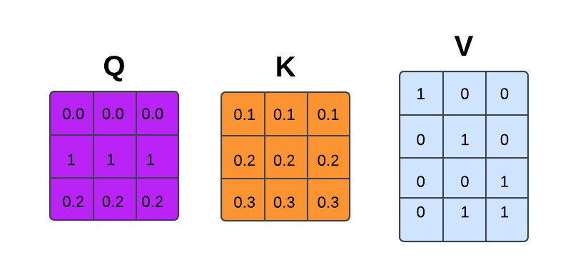
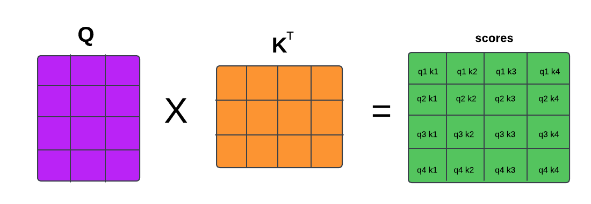
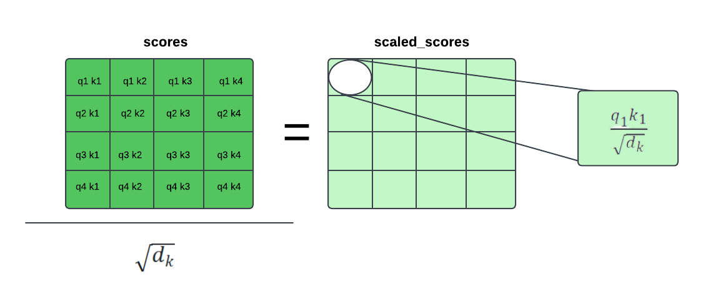
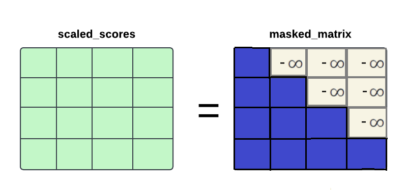
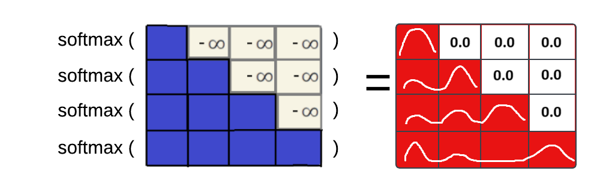
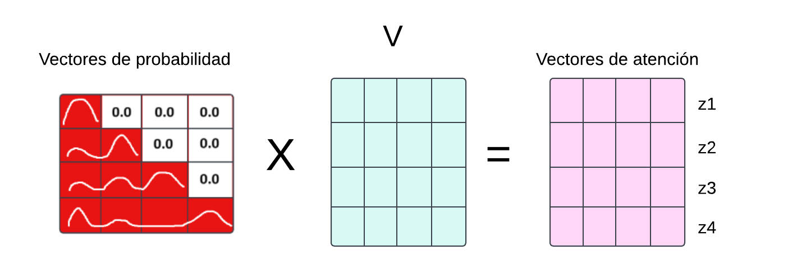

# Práctica: implementación del mecanismo de auto-atención con enmascaramiento del modelo Transformer

- [Susana Suárez](https://github.com/susanasrez).
- [Mara Pareja](https://github.com/marapareja17).

En este repositorio se implementa de manera simple el mecanismo de auto-atención con enmascaramiento de la arquitectura Transformer. La finalidad de ellos es comprender con detalle el funcionamiento dicho mecanismo paso por paso.

## Paso 1. Cálculo de los vectores clave, consulta y valor (K,Q,V)

A partir de las matrices $W^K$, $W^Q$ y $W^V$, las cuales se ajustan durnate el entrenamiento, se calculan los vectores de clave (key), consulta (query) y valor (value). Para este caso simple, ya se disponen de los vectores de consulta, clave y valor.

```python
Q = torch.tensor([[0.0, 0.0, 0.0], [1, 1, 1], [0.2, 0.2, 0.2], [0.3, 0.3, 0.3]])
K = torch.tensor([[0.1, 0.1, 0.1], [0.2, 0.2, 0.2], [0.3, 0.3, 0.3], [0.4, 0.4, 0.4]])
V = torch.tensor([[1., 0., 0.], [0., 1., 0.], [0., 0., 1.], [0., 1., 1.]])
```

<div align="center">
  
</div>

## Paso 2. Cálculo de las puntuaciones de atención

A continuación, se obtienen los *scores* de atención medinate la multiplicación de las matrices de vectores clave y consulta.

```python
scores = torch.matmul(Q, K.t())
```

<div align="center">
  
</div>

## Paso 3. Escalado de las puntuaciones de atención
 
Para estabilizar los valores, se divide cada puntuación por la raíz cuadrada de la dimensión de los vectores $K$ (normalmente denotada como $\sqrt{d_k}$). Esto evita que los valores sean excesivamente grandes, lo cual podría dificultar la convergencia del modelo.

```python
d_k = K.size(-1)
scaled_scores = scores / math.sqrt(d_k)
```

<div align="center">
  
</div>

## Paso 4. Aplicación de la matriz de enmascaramiento

Durante el proceso de entrenamiento, el objetivo es que el modelo anticipe la salida futura en función del contexto actual y previo; es decir, que cada *token* dependa exclusivamente de los *tokens* que le preceden. Para cumplir con esta restricción, es necesario aplicar un enmascaramiento a la matriz antes de ingresarla en la función *softmax*, con el fin de que no se consideren las probabilidades asociadas a los *tokens* futuros.

Este enmascaramiento se logra transformando los elementos en el triángulo superior de la matriz en ceros y, posteriormente, asignándoles el valor $-\infty$. Así, al aplicar la función *softmax*, dichos valores futuros obtendrán una probabilidad cercana a cero, evitando su influencia en el cálculo de las predicciones.

```python
mask = torch.triu(torch.ones(scaled_scores.size(-1), scaled_scores.size(-1)), diagonal=1)
mask = mask == 1
masked_scaled_scores = scaled_scores.masked_fill(mask, float('-inf'))
```

<div align="center">
  
</div>

## Paso 5. Aplicación de la función Softmax

Tras aplicar el enmascaramiento de valores, se utiliza la función softmax en cada fila de la matriz resultante. La función softmax transforma cada fila en una distribución de probabilidad, destacando los tokens más relevantes para la atención y reduciendo la relevancia de aquellos menos importantes. Esto permite que cada token concentre una mayor "atención" en los tokens significativos según su contexto dentro de la secuencia.

```python
attention = torch.nn.functional.softmax(masked_scaled_scores, dim=1)
```

<div align="center">
  
</div>

## Paso 6. Multiplicación con la matriz de valores ($V$)

La matriz de probabilidades obtenida después de la softmax se multiplica con la matriz de valores (V) para obtener el vector de atención final para cada token.

```python
attention_vectors = torch.matmul(attention, V)
```

<div align="center">
  
</div>

En definitiva, si se siguen los pasos descritos anteriormente, se obtienen los vectores de atención, los cuales se utilizan en cada una de las cabezas del transformer.
